# Docker常用命令


## 帮助命令

```shell
docker run --help
#  在你的不了解的命令后面加上 --help
Options:
      --config string      Location of client config files (default "/root/.docker")
  -c, --context string     Name of the context to use to connect to the daemon (overrides DOCKER_HOST env var and default context set with "docker context use")
  -D, --debug              Enable debug mode
  -H, --host list          Daemon socket(s) to connect to
  -l, --log-level string   Set the logging level ("debug"|"info"|"warn"|"error"|"fatal") (default "info")
      --tls                Use TLS; implied by --tlsverify
      --tlscacert string   Trust certs signed only by this CA (default "/root/.docker/ca.pem")
      --tlscert string     Path to TLS certificate file (default "/root/.docker/cert.pem")
      --tlskey string      Path to TLS key file (default "/root/.docker/key.pem")
      --tlsverify          Use TLS and verify the remote
  -v, --version            Print version information and quit

Management Commands:
  builder     Manage builds
  config      Manage Docker configs
  container   Manage containers
  context     Manage contexts
  engine      Manage the docker engine
  image       Manage images
  network     Manage networks
  node        Manage Swarm nodes
  plugin      Manage plugins
  secret      Manage Docker secrets
  service     Manage services
  stack       Manage Docker stacks
  swarm       Manage Swarm
  system      Manage Docker
  trust       Manage trust on Docker images
  volume      Manage volumes

Commands:
  attach      Attach local standard input, output, and error streams to a running container
  build       Build an image from a Dockerfile
  commit      Create a new image from a container's changes
  cp          Copy files/folders between a container and the local filesystem
  create      Create a new container
  deploy      Deploy a new stack or update an existing stack
  diff        Inspect changes to files or directories on a container's filesystem
  events      Get real time events from the server
  exec        Run a command in a running container
  export      Export a container's filesystem as a tar archive
  history     Show the history of an image
  images      List images
  import      Import the contents from a tarball to create a filesystem image
  info        Display system-wide information
  inspect     Return low-level information on Docker objects
  kill        Kill one or more running containers
  load        Load an image from a tar archive or STDIN
  login       Log in to a Docker registry
  logout      Log out from a Docker registry
  logs        Fetch the logs of a container
  pause       Pause all processes within one or more containers
  port        List port mappings or a specific mapping for the container
  ps          List containers
  pull        Pull an image or a repository from a registry
  push        Push an image or a repository to a registry
  rename      Rename a container
  restart     Restart one or more containers
  rm          Remove one or more containers
  rmi         Remove one or more images
  run         Run a command in a new container
  save        Save one or more images to a tar archive (streamed to STDOUT by default)
  search      Search the Docker Hub for images
  start       Start one or more stopped containers
  stats       Display a live stream of container(s) resource usage statistics
  stop        Stop one or more running containers
  tag         Create a tag TARGET_IMAGE that refers to SOURCE_IMAGE
  top         Display the running processes of a container
  unpause     Unpause all processes within one or more containers
  update      Update configuration of one or more containers
  version     Show the Docker version information
  wait        Block until one or more containers stop, then print their exit codes
```


## 镜像命令

**docker images** 查看本地的所有镜像

```shell
[root@localhost ~]# docker images
REPOSITORY                  TAG                 IMAGE ID            CREATED             SIZE
daocloud.io/library/nginx   1.13.0-alpine       f00ab1b3ac6d        3 years ago         15.5MB

#解释
REPOSITORY    镜像源
TAG           镜像版本
IMAGE ID      镜像ID
CREATED       镜像创建时间
SIZE          奖项大小

#可选项
  -a, --all      #列出所有镜像
  -q, --quiet    #只列出镜像id
```


**docker pull** 从仓库拉去镜像

```shell
# 下载镜像 docker pull 镜像名[:tag]    没加tag默认拉去最新
[root@localhost ~]# docker pull daocloud.io/library/nginx:1.13.2
1.13.2: Pulling from library/nginx
177c8d195b28: Pull complete 
bab69a92ab1c: Pull complete 
049b14802d7a: Pull complete 
Digest: sha256:c62da9122f270a48645eb154c9a02989c343825903974950651e763ea40a46a9
Status: Downloaded newer image for daocloud.io/library/nginx:1.13.2
daocloud.io/library/nginx:1.13.2
```


**docker rmi** 删除镜像

```shell
[root@localhost ~]# docker rmi -f 容器id                  #删除指定容器
[root@localhost ~]# docker rmi -f 容器id 容器id            #删除多个容器
[root@localhost ~]# docker rmi -f $(docker images -aq)   #删除所有容器
```


## 容器命令

 **新建容器并运行**

```shell
docker run [可选参数] image

# 参数说明
  --name="name"    容器名称， 区分容器
  -d               后台方式运行
  -it              使用交付模式，进入容器查看内容
  -p               指定容器的端口
    -p ip:主机端口:容器端口
    -p 主机端口:容器端口
    -p 容器端口
  -P               随机指定端口
  -rm              用完就删除
  -v 主机路径:容器路径  挂载数据卷

#测试创建并进入容器
[root@localhost ~]# docker run --name="my-nginx" -it -p 8080:80 -v /data:/data

#从容器退出到主机
[root@localhost ~]# eixt
  
```

**列出所有运行的容器**

```shell
# docker ps 
        # 列出所有正在运行的容器
  -a    # 列出所有的容器，包括正在运行和曾经运行的容器
  -n=?  # 显示最近创建的容器
  -q    # 显示容器id
  
[root@localhost ~]# docker ps
CONTAINER ID        IMAGE               COMMAND             CREATED             STATUS              PORTS               NAMES
[root@localhost ~]# docker ps -a
CONTAINER ID        IMAGE               COMMAND                  CREATED             STATUS                    PORTS               NAMES
2bdb808adcda        f00                 "nginx -g 'daemon of…"   47 hours ago        Exited (0) 47 hours ago                       my-nginx
[root@localhost ~]# docker ps -q
[root@localhost ~]# docker ps -aq
2bdb808adcda
```

**退出容器**

```shell
exit          # 退出容器并停止运行
Ctrl + P + Q  # 退出容器，不停止运行
```

**删除容器**

```shell
docker rm 容器id                # 删除指定容器， 如果删除正在运行的容器, 加 -f 强制删除
docker rm -f $(docker ps -aq)  # 删除所有容器
```

**启动停止容器**

```shell
docker strat 容器id    # 启动
docker stop 容器id     # 停止容器
docker restart 容器id  # 重启容器
docker kill 容器id     # 强制停止容器
```


## 常用其他命令

**后台启动容器**

```shell
# docker run -d 镜像名

[root@localhost ~]# docker run -d centos

# docker ps 后发现容器没有运行

# 常见的坑， docker启动容器后台运行， 就必须有一个前台前台进程 docker发现没有应用， 就会自动停止

# 列如centos 容器启动后， 发现自己没有提供服务， 就会立即停止， 就没有运行呢, 解决这个问题的话， 就-it 再Ctrl + P + Q 再退出
```

**查看容器日志**

```shell
# docker logs 可选参数 容器id
  -tf            # 显示日志
  --tail number  # 显示日志条数
```

**查看容器内的进程**

```shell
# docker top 容器id
```

**查看容器内的源数据**

```shell
# docker inspect 容器id
```

**进入正在运行的容器**

```shell
# 我们通常容器使用都是后台运行模式， 需要进入容器，修改一些配置

# 命令
docker exec 容器id    # 进入容器后， 打开一个新的终端
docker attach 容器id  # 进入容器正在运行的终端， 不会启动新进程

[root@localhost ~]# docker ps
CONTAINER ID        IMAGE               COMMAND                  CREATED             STATUS              PORTS                NAMES
8f04eac497f9        2f7                 "nginx -g 'daemon of…"   6 minutes ago       Up 5 seconds        0.0.0.0:80->80/tcp   my-nginx
[root@localhost ~]# docker exec -it 8f sh
# read escape sequence
[root@localhost ~]# docker ps
CONTAINER ID        IMAGE               COMMAND                  CREATED             STATUS              PORTS                NAMES
8f04eac497f9        2f7                 "nginx -g 'daemon of…"   7 minutes ago       Up About a minute   0.0.0.0:80->80/tcp   my-nginx

```

**从容器内拷贝文件到主机**

```shell
# docker cp 容器id:容器内部路径 主机路径

[root@localhost ~]# docker cp 2bdb808adcda:/data /data
```


## commit提交自定义镜像

```shell
# docker commit -m="提交描述信息" -a="作者" 容器id 目标镜像名:[TAG版本]
```


# 容器数据卷


## 什么是容器数据卷

**docker的理念回顾**

将应用和环境打包成一个镜像

数据 ？如果数据都在容器中 ， 那么我们容器删除 ，数据就会丢失！**需求：数据可以持久化**

MySQL ，容器删除 ，删除跑路 ！**需求：MySQL数据可以存储在本地**

容器之间可以有一个数据共享的技术 ！Docker容器中产生的数据 ，同步到本地！

这就是卷技术 ！目录的挂载 ， 将我们的容器内的目录 ，挂载到linux上 


## 具名和匿名挂载

```shell
# 匿名挂载
-v 容器内部路径 # 可以不指定主机挂载路径, 这种匿名挂载， 我们只在-v里写了容器的路径， 没有名字
docker run --name="my-nginx-volume" -p 80:80 -d  -v /etc/nginx 2f7

[root@localhost ~]# docker run --name="my-nginx-volume" -p 80:80 -d  -v /etc/nginx 2f7
e3d5bd24c61c62375d77ce717305001d461238993d60b4ba16efaa0b43062e34

# 查看所有的 volume 卷挂载情况
[root@localhost ~]# docker volume ls
DRIVER              VOLUME NAME
local               8184d93aee0d382678bda84b53260a8fe7a6ec661bad8d6e740f3b95be8cf369


# 这种匿名挂载， 我们只在-v里写了容器的路径， 没有名字
# 具名挂载
# -v 卷名:容器路径

[root@localhost ~]# docker run --name="my-nginx-volume-name" -p 8080:80 -d  -v juming-nginx:/etc/nginx 2f7
fcf87e2e32aec73d5357b51c226c2ed17cb03fd41fd9d1a15b2243248d07429a
[root@localhost ~]# docker volume ls
DRIVER              VOLUME NAME
local               8184d93aee0d382678bda84b53260a8fe7a6ec661bad8d6e740f3b95be8cf369
local               juming-nginx

# 查一下具体挂载信息
# docker volume inspect 卷名
[root@localhost ~]# docker volume inspect juming-nginx
[
    {
        "CreatedAt": "2020-12-10T18:34:04+08:00",
        "Driver": "local",
        "Labels": null,
        "Mountpoint": "/var/lib/docker/volumes/juming-nginx/_data",
        "Name": "juming-nginx",
        "Options": null,
        "Scope": "local"
    }
]
```

所有没有指定挂载主机的路径， 目录都在  `/var/lib/docker/volumes/xxxx/_data`
我们可以通过具名挂载方便找到我们的 一个卷 ， 大多数情况下使用具名挂载

```shell
# 如何确定具名挂载、匿名挂载和指定路径挂载
-v 容器路径         # 匿名挂载
-v 卷名:容器路径     # 具名挂载
-v 主机路径:容器路径  # 指定路径挂载
```

**拓展：**

```shell
# -v 容器路径:ro   rw  改变读写权限

ro    # 只读
rw    # 可读可写

# 一旦设置了这个卷的权限， 容器对我们的挂载卷就有了限制
docker run --name my-nginx -p 8080:80 -d  -v juming-nginx:/etc/nginx:ro 2f7
docker run --name= my-nginx -p 8080:80 -d  -v juming-nginx:/etc/nginx:rw 2f7

# 看到ro 就说明这个路径只能主机来操作 容器内部无法操作

```


## 初始Dockerfile

```shell
# docker build 参数 .  注意最后面这个点
  -f 路径           # 指定Dockerfile文件路径 
  -t 镜像名称:tag .  # 镜像名字和版本 注意-t后面最后这个 .  

# 创建一个dockerfile文件， 名字可以随便取， 建议使用Dockerfile 
# 文件中的 指令（大写） 参数
FROM daocloud.io/library/centos

VOLUME ["volume1", "volume2"]

# 使用build 将dockerfile文件打包成镜像
[root@localhost docker]# docker build -f /docker/Dockerfile -t my-build-centos:1.0 .
```

.jpg)


**run起我们的自定义的my-build-centos镜像， 并进去看看我们的数据卷挂载情况**

docker run --name my-centos1 -it -d 69fcef53c7fd

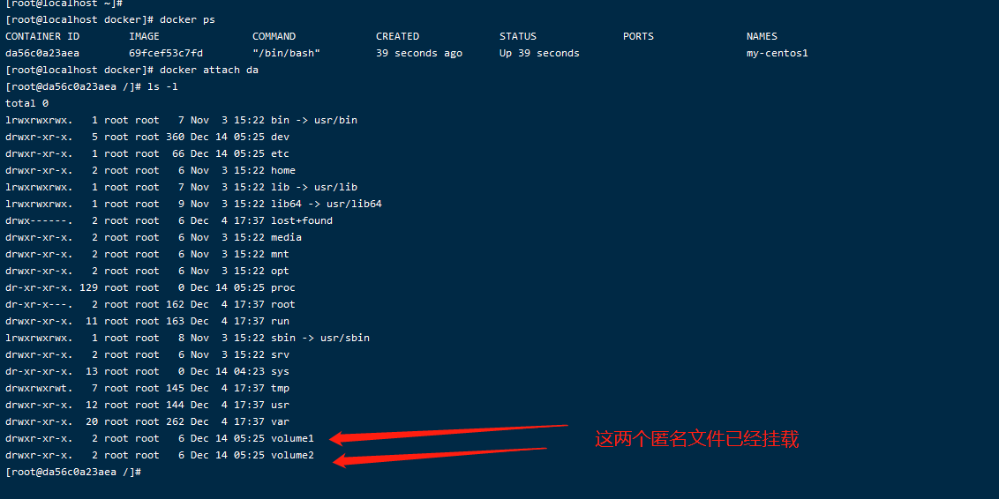


## 数据卷容器

实现多个容器数据卷共享

根据上面我们自己构建的容器my-centos1， 我们再构建一个my-centos2的容器与my-centos1数据卷共享

```shell
# --volumes-from 容器名称

# docker run --name my-centos2 -it --volumes-from my-centos1 69fcef53c7fd
```


我们用attach进入my-centos1容器内创建一下文件

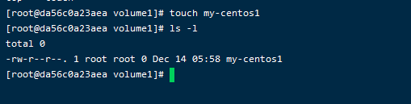

进去my-centos2查看文件数据卷同步成功没有

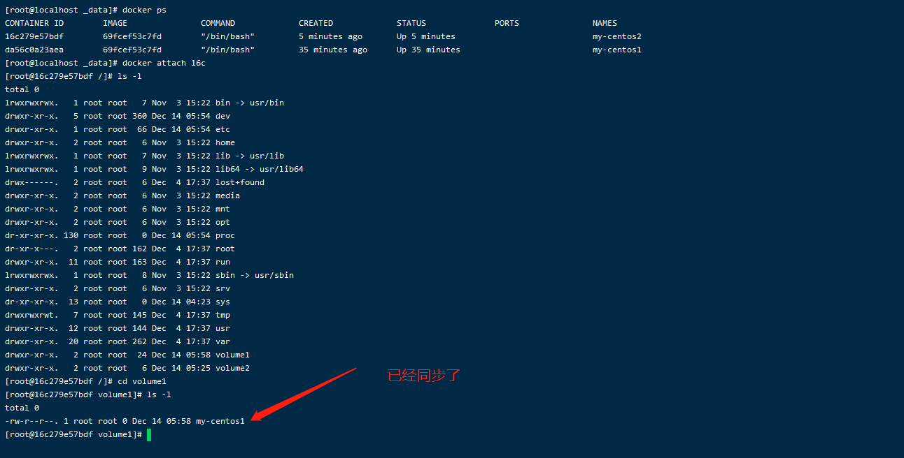

```shell
# 即使--volumes-from 的容器关闭或者删除， 数据卷内的文件依旧存在
```


**结论 ：** 

  容器之间配置信息的传递 ， 数据卷容器的生命周期一直持续到没有容器使用位置

但是一旦里持久化到了本地 ， 这个时候 ， 本地的数据不会删除


# DockerFile

 

## Dockerfile介绍

  Dockerfile 是构建docker镜像的文件 ！ 命令参数脚本 ！

构建步骤 ：

  1、编写 Dockerfile 文件

  2、docker build 构建成为一个镜像

  3、docker run 运行镜像

  4、docker push 发布镜像  （DockerHub、 阿里云镜像）


## DockerFile构建过程


## DockerFile指令

```shell
FROM          # 基础镜像 ， 一切从这个开始
MAINTAINER    # 镜像谁写的 ， 姓名 + 邮箱
RUN           # 镜像构成时需要执行的命令 
ADD           # 步骤 ： tomcat镜像， 这个tomcat压缩包 添加的内容
WORKDIR       # 镜像的工作目录 进去容器后的目录
VOLUME        # 数据挂载目录
EXPOSE        # 开放端口
CMD           # 指定这个容器启动的时候运行的命令，只有最后一个会生效，可被替代
ENTRYPOINT    # 指定这个容器启动的时侯运行的命令，可以追加命令
ONBUILD       # 当构建一个被继承 Dockerfile 这个时候就会运行ONBUILD 的指令， 出发指令
COPY          # 类似ADD 将我们的文件拷贝到镜像中
ENV           # 构建容器时设置环境变量
```

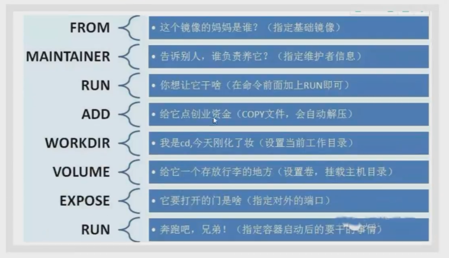


## 实战测试

```shell
# 构建自己的一个centos镜像

# 1、 编写一个 dockerfile 文件
[root@localhost docker]# cat Dockerfile 
FROM centos
MAINTAINER xiaowei<hi.wulaoye@qq.com>

ENV MYPATH /bin
WORKDIR $MYPATH

RUN yum install vim -y

EXPOSE 80

CMD echo $MYPACH
CMD echo '------end-----'
CMD /bin/bash 

# 2、 通过 build 命令运行 dockerfile 文件
# 命令docker build -f Dockerfile文件路径 -t 镜像名:[tag] .
# 一定要注意这个命令最后加 . 符号
[root@localhost docker]# docker build -f Dockerfile -t my-build-centos:1.0 .

# 查看镜像的构造步骤信息
[root@localhost docker]# docker history 镜像id
IMAGE               CREATED              CREATED BY                                      SIZE                COMMENT
3731457ed737        About a minute ago   /bin/sh -c #(nop)  CMD ["/bin/sh" "-c" "/bin…   0B                  
e3b5b48f6039        About a minute ago   /bin/sh -c #(nop)  CMD ["/bin/sh" "-c" "echo…   0B                  
8315a421d508        About a minute ago   /bin/sh -c #(nop)  CMD ["/bin/sh" "-c" "echo…   0B                  
cbcd609392af        About a minute ago   /bin/sh -c #(nop)  EXPOSE 80                    0B                  
598e31c785f0        About a minute ago   /bin/sh -c yum install vim -y                   57.7MB              
da7db7f7a059        2 minutes ago        /bin/sh -c #(nop) WORKDIR /bin                  0B                  
2fd8d0b26431        2 minutes ago        /bin/sh -c #(nop)  ENV MYPATH=/bin              0B                  
1b9d955b6294        2 minutes ago        /bin/sh -c #(nop)  MAINTAINER xiaowei<hi.wul…   0B                  
300e315adb2f        6 days ago           /bin/sh -c #(nop)  CMD ["/bin/bash"]            0B                  
<missing>           6 days ago           /bin/sh -c #(nop)  LABEL org.label-schema.sc…   0B                  
<missing>           6 days ago           /bin/sh -c #(nop) ADD file:bd7a2aed6ede423b7…   209MB   
```


# docker网络

 

## 理解docker0

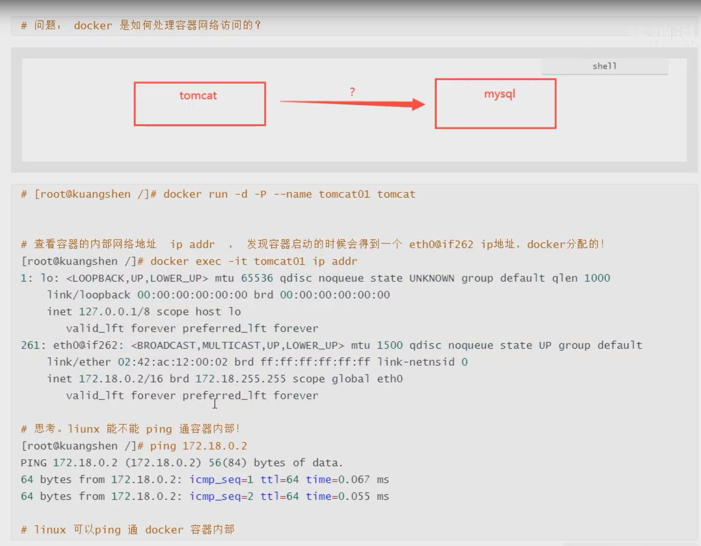

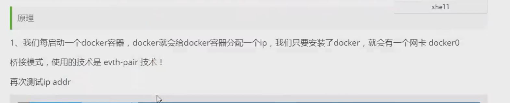

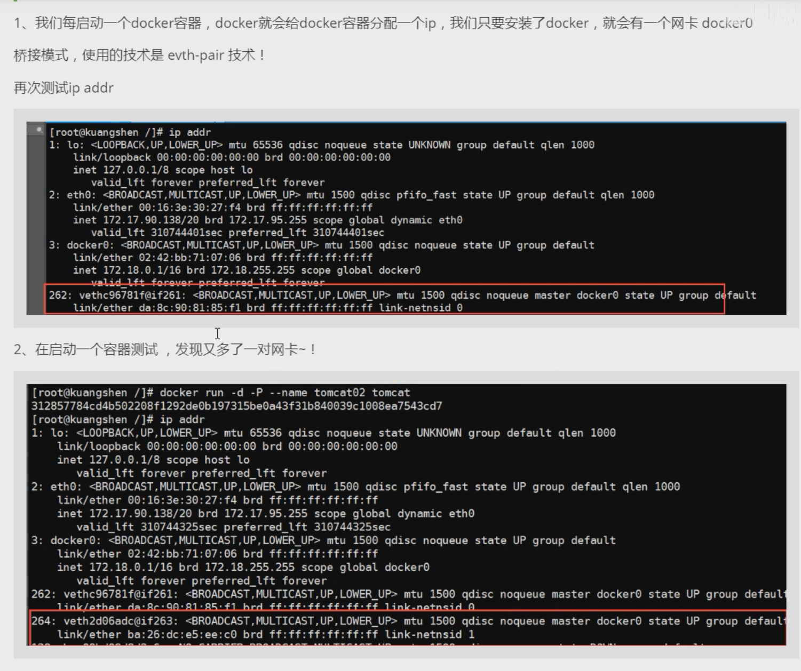


## --link

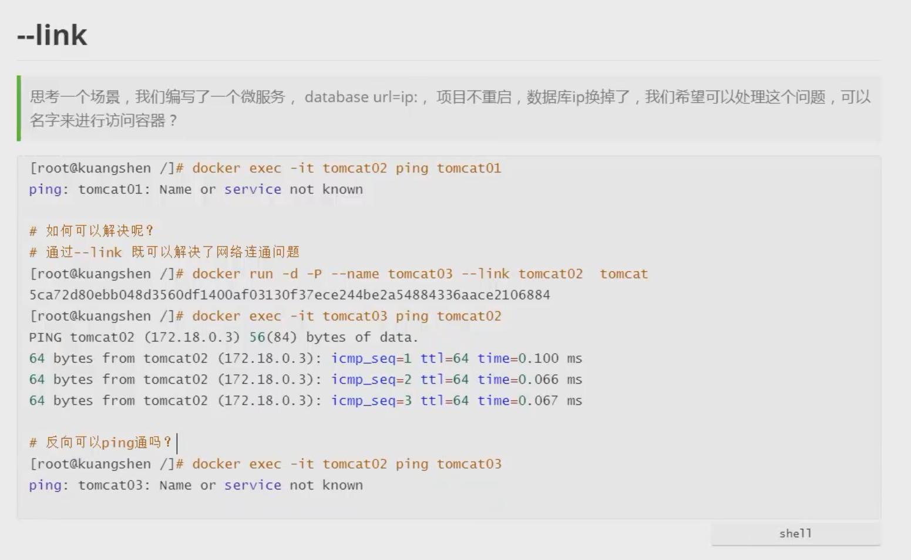


## 自定义网络


**查看所有docker网络**

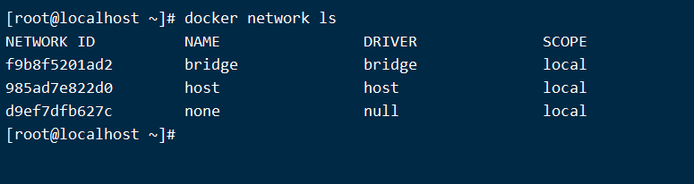


**网络模式**

bridge ： 桥接 docker （默认）

none ： 不配置网络

host ： 和宿主机共享网络

**测试**

```shell
# 我们直接启动的命令 --net bridge, 而这个就是我们的docker0
docker run -d -P --name tomcat01 tomcat
docker run -d -P --name tomcat01 --net bridge tomcat

# docker0特点： 默认，域名不能访问， --link可以打通链接

# 我们可以自定义一个网络
# --driver bridge            设定网络模式
# --subnet 192.168.0.0/16    子网配置
# --gateway 192.168.0.1      网关
# 最后是自定义网络名称
[root@localhost ~]# docker network create --driver bridge --subnet 192.168.0.0/16 --gateway 192.168.0.1 mynet
7886412b880f34bfcc557ababe90d9ef115aa960e9099e31b48911b0ee3f62ec
[root@localhost ~]# docker network ls
NETWORK ID          NAME                DRIVER              SCOPE
f9b8f5201ad2        bridge              bridge              local
985ad7e822d0        host                host                local
7886412b880f        mynet               bridge              local
d9ef7dfb627c        none                null                local

```

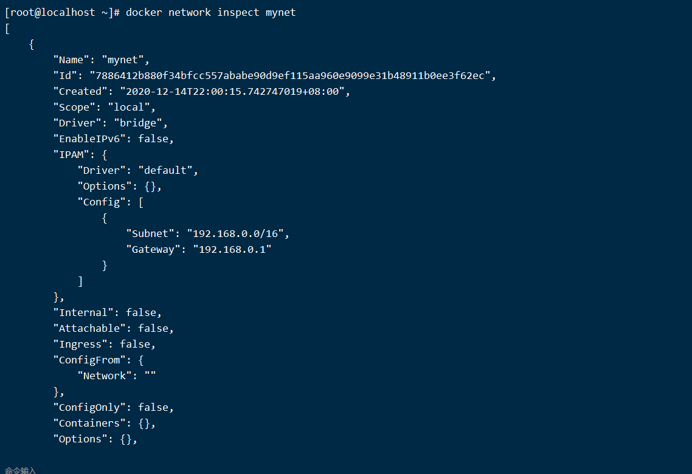


```shell
# --net 网络名称  这个设置我们的自定义网络
[root@localhost ~]# docker run --name my-net-01 -it -P --net mynet centos:latest 

# 创建完my-net-01，之后再创建一个my-net-02
[root@localhost ~]#  docker run --name my-net-02 -it -P --net mynet centos:latest

[root@localhost ~]# docker ps
CONTAINER ID        IMAGE               COMMAND             CREATED             STATUS              PORTS               NAMES
ef845a4a7a3a        centos:latest       "/bin/bash"         2 minutes ago       Up 2 minutes                            my-net-02
dd8a6e0e5149        centos:latest       "/bin/bash"         10 minutes ago      Up 10 minutes                           my-net-01

# ping ip 能通过
[root@localhost ~]# docker exec my-net-01 ping 192.168.0.3
PING 192.168.0.3 (192.168.0.3) 56(84) bytes of data.
64 bytes from 192.168.0.3: icmp_seq=1 ttl=64 time=0.054 ms
64 bytes from 192.168.0.3: icmp_seq=2 ttl=64 time=0.047 ms
# 我们自定义网络，不用--link 也能ping名字
[root@localhost ~]# docker exec my-net-01 ping my-net-02
PING my-net-02 (192.168.0.3) 56(84) bytes of data.
64 bytes from my-net-02.mynet (192.168.0.3): icmp_seq=1 ttl=64 time=0.041 ms
64 bytes from my-net-02.mynet (192.168.0.3): icmp_seq=2 ttl=64 time=0.050 ms
64 bytes from my-net-02.mynet (192.168.0.3): icmp_seq=3 ttl=64 time=0.051 ms
^C
```

我们自定义得网络docker都已经帮我们维护好呢对应得关系， 推荐平时这样使用网络


好处：

redis - 不同得集群使用不同的网络， 保证集群是安全健康的

mysql - 不同得集群使用不同的网络， 保证集群是安全健康的


## 网络联通

**连接一个网络到容器**

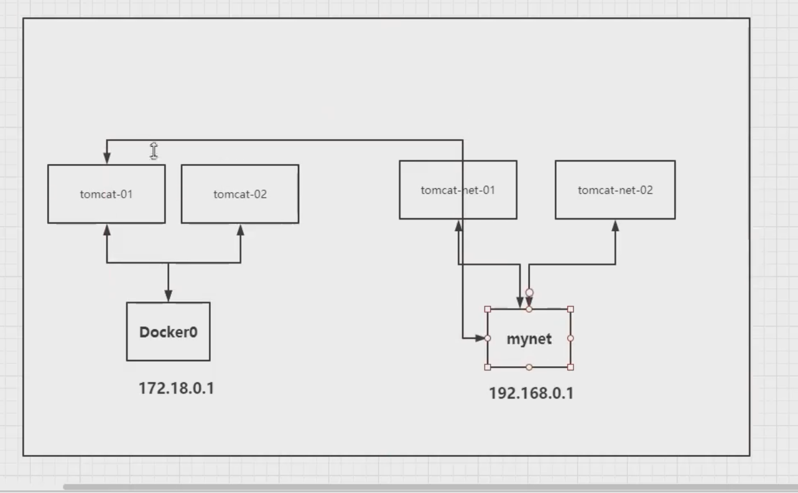


```shell
[root@localhost ~]# docker network connect --help
Usage:  docker network connect [OPTIONS] NETWORK CONTAINER

# docker network connect 网络名称 容器名称
[root@localhost ~]# docker network connect mynet centos-docker0

# 先创建一个docker0-centos容器
[root@localhost ~]# docker run --name docker0-centos -it -d my-build-centos:1.0

[root@localhost ~]# docker ps
CONTAINER ID        IMAGE                 COMMAND                  CREATED             STATUS              PORTS               NAMES
fa952d4dd424        my-build-centos:1.0   "/bin/sh -c /bin/bash"   33 seconds ago      Up 32 seconds       80/tcp              docker0-centos
ef845a4a7a3a        centos:latest         "/bin/bash"              About an hour ago   Up About an hour                        my-net-02
dd8a6e0e5149        centos:latest         "/bin/bash"              About an hour ago   Up About an hour                        my-net-01

# 现在我们想 docker0-centos ping 通my-net-01
[root@localhost ~]# docker exec docker0-centos ping my-net-01
# 发现ping不通
[root@localhost ~]# 71 packets transmitted, 0 received, 100% packet loss, time 179ms

# 连通需要 在网络追加容器
[root@localhost ~]# docker network connect mynet docker0-centos
# 测试联通 
[root@localhost ~]# docker network connect mynet docker0-centos
[root@localhost ~]# docker exec -it docker0-centos ping my-net-01
PING my-net-01 (192.168.0.2) 56(84) bytes of data.
64 bytes from my-net-01.mynet (192.168.0.2): icmp_seq=1 ttl=64 time=0.038 ms
64 bytes from my-net-01.mynet (192.168.0.2): icmp_seq=2 ttl=64 time=0.031 ms
64 bytes from my-net-01.mynet (192.168.0.2): icmp_seq=3 ttl=64 time=0.027 ms
64 bytes from my-net-01.mynet (192.168.0.2): icmp_seq=4 ttl=64 time=0.030 ms
^C
--- my-net-01 ping statistics ---
4 packets transmitted, 4 received, 0% packet loss, time 6ms
rtt min/avg/max/mdev = 0.027/0.031/0.038/0.006 ms

# 连通之后就是将 docker0-centos 直接放到了 mynet网络下了

# 一个容器两个ip地址
# 阿里云服务：公网ip  私网的 概念
```

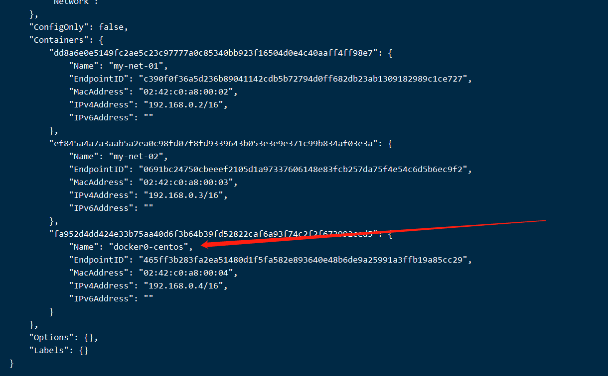